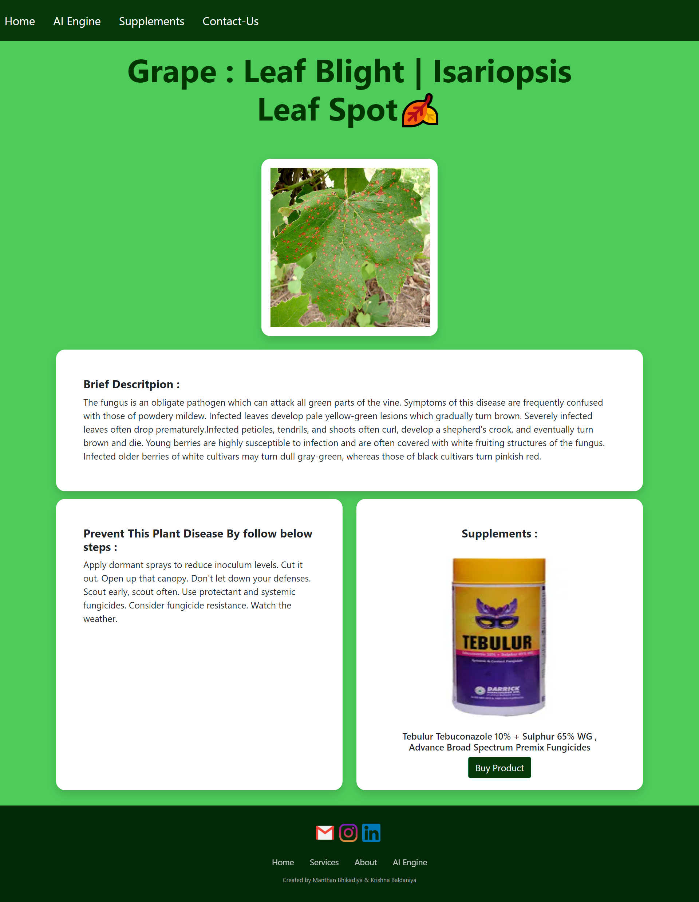

# 🌿 Plant Disease Detection System


An intelligent deep learning-based system designed to detect and diagnose plant diseases from leaf images. Using a **Convolutional Neural Network (CNN)** built with **PyTorch**, this system can classify leaf images into **39 different categories**, providing farmers and gardeners with instant diagnosis and treatment recommendations.

---

## ✨ Key Features

- **🚀 Real-time Detection**: Upload leaf images and get instant results.
- **📊 39 Disease Categories**: Comprehensive coverage for various plants including Apple, Tomato, Potato, Grape, and more.
- **💊 Treatment Recommendations**: Provides descriptions, prevention steps, and supplement suggestions.
- **👤 User Management**: Secure login/signup system to track diagnosis history.
- **📈 Analytics Dashboard**: Visualize disease trends and detection success rates.
- **🔔 Notifications**: Stay updated with the latest detections and system alerts.
- **🏪 Supplement Store**: Integrated marketplace for recommended fertilizers and treatments.

---

## 🛠️ Tech Stack

- **Backend**: Flask (Python)
- **Deep Learning**: PyTorch, Torchvision
- **Database**: SQLite (SQLAlchemy)
- **Frontend**: HTML5, CSS3 (Vanilla), JavaScript
- **Data Handling**: Pandas, NumPy, Pillow

---

## 🚀 Getting Started

Follow these steps to set up the project on your local machine.

### 1. Prerequisites
Ensure you have **Python 3.8 or higher** installed.

### 2. Clone the Repository
```bash
git clone https://github.com/Dhanish-AI/Plant_Disease_Detection_System.git
cd Plant_Disease_Detection_System
```

### 3. Set Up Virtual Environment
```bash
# Create virtual environment
python -m venv venv

# Activate virtual environment
# On Windows:
venv\Scripts\activate
# On macOS/Linux:
source venv/bin/activate
```

### 4. Install Dependencies
```bash
pip install -r Flask_Deployed_App/requirements.txt
```

### 5. 📥 Download Pre-trained Model (CRITICAL)
Due to file size limits on GitHub, the trained model file is hosted externally.
1. **Download** the model file (`plant_disease_model_1_latest.pt`) from this **[Google Drive Link](https://drive.google.com/drive/folders/1ewJWAiduGuld_9oGSrTuLumg9y62qS6A?usp=share_link)**.
2. **Move** the downloaded file into the `Flask_Deployed_App/` directory.

### 6. Run the Application
```bash
cd Flask_Deployed_App
python app.py
```
The application will be available at `http://127.0.0.1:5000`.

---

## 📂 Project Structure

```text
├── Flask_Deployed_App/
│   ├── app.py              # Main Flask application
│   ├── CNN.py              # Model architecture definition
│   ├── models.py           # Database models (User, History, etc.)
│   ├── requirements.txt    # Project dependencies
│   ├── disease_info.csv    # Disease metadata & treatment info
│   ├── static/             # CSS, JS, and uploaded images
│   └── templates/          # HTML templates
├── Model/
│   └── Plant Disease Detection Code.ipynb  # Training notebook
├── test_images/            # Sample images for testing
└── demo_images/            # Screenshots for documentation
```

---

## 📸 Screenshots

| Home Page | AI Engine |
|---|---|
|  |  |

| Results | Market |
|---|---|
|  |  |

---

## 🤝 Contributing

Contributions are welcome! If you'd like to improve the UI, enhance the model, or add features:
1. Fork the Project
2. Create your Feature Branch (`git checkout -b feature/AmazingFeature`)
3. Commit your Changes (`git commit -m 'Add some AmazingFeature'`)
4. Push to the Branch (`git push origin feature/AmazingFeature`)
5. Open a Pull Request

---

## 📧 Contact

Dhanish - [GitHub](https://github.com/Dhanish-AI)

Project Link: [https://github.com/Dhanish-AI/Plant_Disease_Detection_System](https://github.com/Dhanish-AI/Plant_Disease_Detection_System)

---
*Note: This project is for educational and research purposes. Always consult with agricultural experts for critical crop management decisions.*
